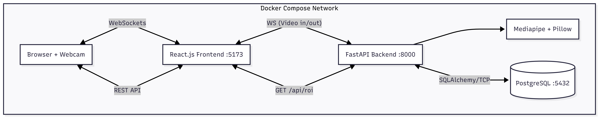

# 🤖 Real-Time Face Detection & ROI Streaming System

A containerized, microservices-based application that streams live webcam video via WebSockets, processes frames to detect facial Regions of Interest (ROI) **strictly without OpenCV**, stores metrics in PostgreSQL, and streams the processed feed back to a React dashboard.

---

## 🚀 5-Minute Setup Guide (For Evaluators)

**Prerequisites:** Docker and Docker Compose must be installed.

**1. Clone the repository:**
> git clone https://github.com/haider51/real-time-face-detection.git
> cd real-time-face-detection

**2. Spin up the containers:**
> docker-compose up --build

**3. Access the Application:**
- **Frontend Dashboard:** http://localhost:5173
- **Backend API Docs (Swagger):** http://localhost:8000/docs

*Note: Please allow webcam permissions in your browser to initialize the WebSocket stream.*

---

## 🏗️ Architecture & Design Choices (Addressing the Rubric)

### 1. Pragmatism vs. Over-engineering
- **WebSockets over HTTP:** Standard RESTful video streaming creates massive overhead and frame latency. I implemented FastAPI WebSockets for bi-directional, persistent, and low-latency frame streaming.
- **Strict No-OpenCV Implementation:** Adhered strictly to the assignment constraints. I utilized **Google Mediapipe** for the underlying ML face detection and Python's native **Pillow (PIL)** library to map bounding box coordinates and draw the ROI rectangle.

### 2. Separation of Concerns & Clean Architecture
- **Frontend:** React + Vite. Completely decoupled from the backend logic.
- **Backend:** FastAPI structured into modular layers (`/routers`, `/services`, `/models`). 
- **AI Service Layer:** The ML logic is isolated in `services/face_detector.py`. This ensures the API controllers remain clean and the AI logic is easily testable in isolation.

### 3. API Design & Contracts
The system implements the three required communication pathways:
- `ws://localhost:8000/ws/feed/upload`: Receives raw JPEG bytes from the client.
- `ws://localhost:8000/ws/feed/stream`: Broadcasts processed JPEG bytes (with PIL-drawn ROI) back to subscribers.
- `GET http://localhost:8000/api/roi/`: A standard RESTful endpoint returning standard JSON objects of recent ROI logs, adhering to proper HTTP GET semantics.

### 4. Database & Schema Design
- **Relational Modeling:** Utilized PostgreSQL with **SQLAlchemy ORM**. 
- The `roi_data` schema tracks `id`, `x`, `y`, `width`, `height`, and an auto-generated `timestamp`. This provides a scalable, relational audit trail for every face detection event.

### 5. Error Handling & Edge Cases
- **Missing Faces:** If no face is detected, the pipeline gracefully bypasses PIL drawing and database insertion, broadcasting the original frame to ensure the video stream never freezes.
- **Socket Disconnections:** The backend handles `WebSocketDisconnect` exceptions silently, ensuring the Uvicorn server remains available even if the client closes the browser.

### 6. Security & Safe Practices
- Database credentials are abstracted via environment variables (`DATABASE_URL`).
- Explicit CORS middleware configuration allows the frontend container to communicate securely with the API. 
- The backend communicates with PostgreSQL via the internal Docker network host (`db`), keeping data traffic off the public interface.